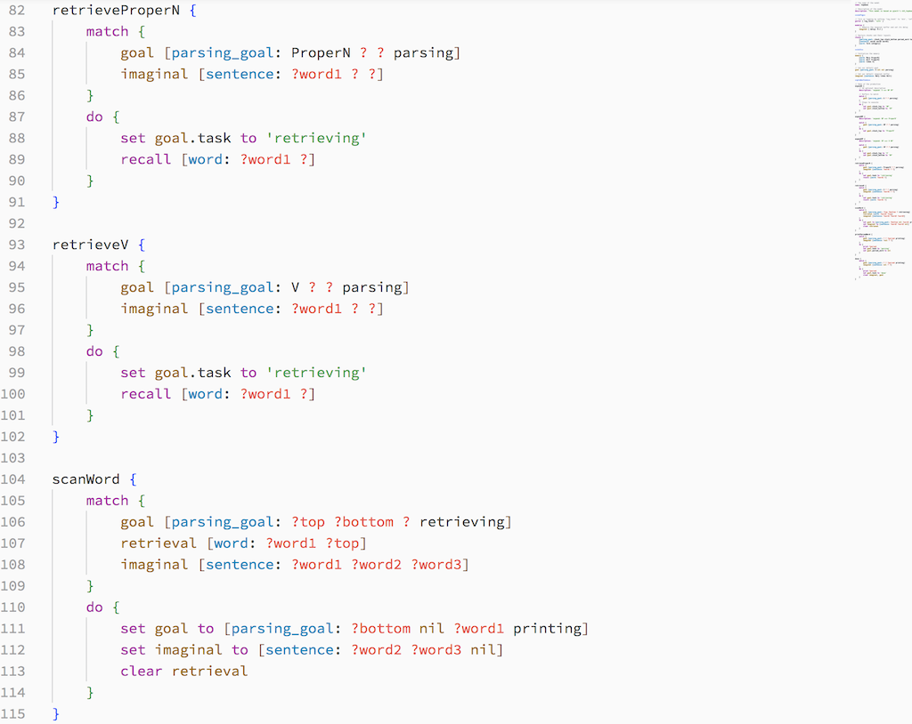
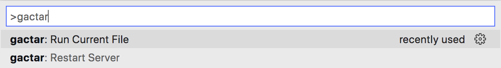
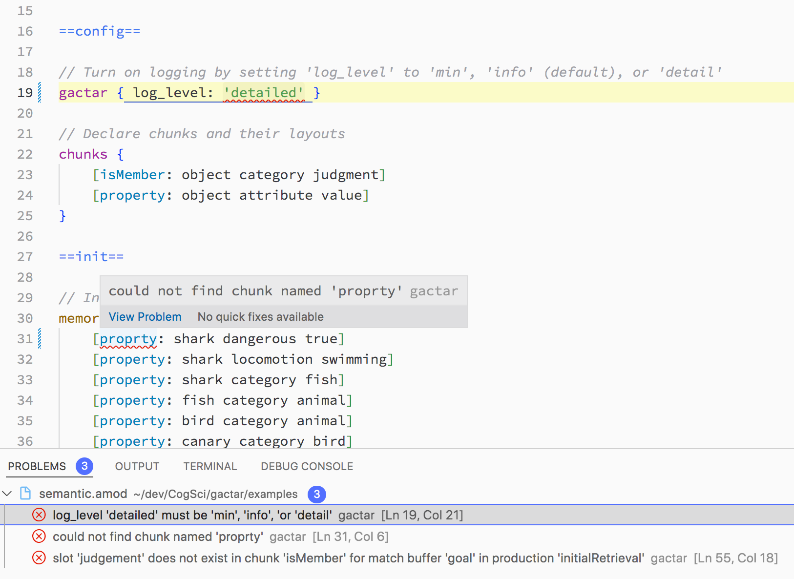
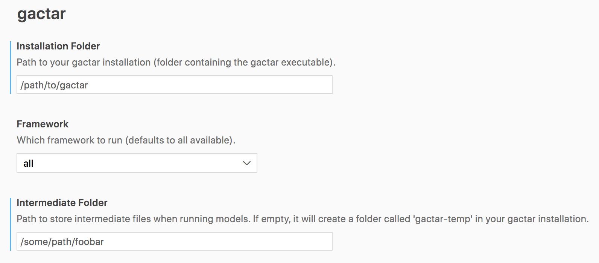

[](https://marketplace.visualstudio.com/items?itemName=asmaloney.gactar) [](LICENSE)

#  gactar-vscode

_gactar-vscode_ is a plugin for VS Code for working with [gactar](https://github.com/asmaloney/gactar)'s [amod files](https://github.com/asmaloney/gactar#gactar-models).

It implements syntax highlighting, provides snippets to quickly create an amod file or add productions, and allows you to run gactar directly through VS Code.

## Features

### Syntax highlighting

Provides syntax highlighting for .amod files.



### Snippets

Provides snippets when editing amod files:

- Typing _amod_ will show a snippet to **Insert basic amod template**. This will fill in a complete, empty amod file.
- Type _prod_ will show a snippet to **Insert amod Production**. This will add an empty production like this:

  ```
   <cursor here> {
    description: ''

    match {
        goal []
    }
    do {
    }
  }
  ```

### Run Code Through gactar

If you have gactar installed, you can point VS Code at your installation and run your amod files through gactar from VS Code. You can access the command through VS Code's [Command Palette](https://code.visualstudio.com/docs/getstarted/userinterface#_command-palette):



The results will show up in VSCode's Output Panel.

### Restart The Server

If you need to restart the gactar server, you can run the command `gactar: Restart Server`.

### Highlight Problems

After running amod files, any errors will be reported in the Problems Panel and they will be highlighted in the code.



## Configuration

You can set your configuration using the VS Code Settings window:


Or you can set them directly in your `settings.json` file:

- `"gactar.installationFolder"` (required to run gactar) - Path to your gactar installation (folder containing the gactar executable).
- `"gactar.framework"` - Which framework to run. Allowed: `ccm`, `pyactr`, `vanilla`, or `all`.
- `"gactar.intermediateFolder"` - Path to store intermediate files (the generated code for each framework) when running models. If empty, it will create a folder called 'gactar-temp' in your gactar installation.

## gactar Reference

I wrote up a technical note about [gactar](https://github.com/asmaloney/gactar) which includes more information about the amod format. It may be found on [ResearchGate](https://www.researchgate.net/).

**Title:** gactar: A Tool For Exploring ACT-R Modelling

**DOI:** [10.13140/RG.2.2.25387.36642](https://dx.doi.org/10.13140/RG.2.2.25387.36642)
